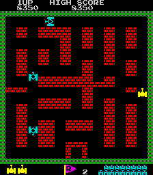
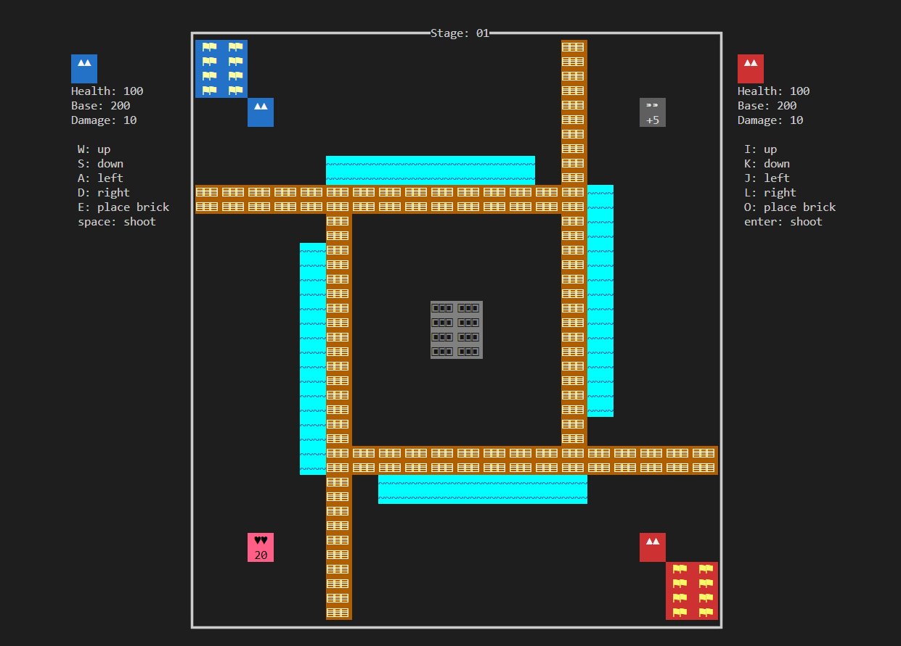
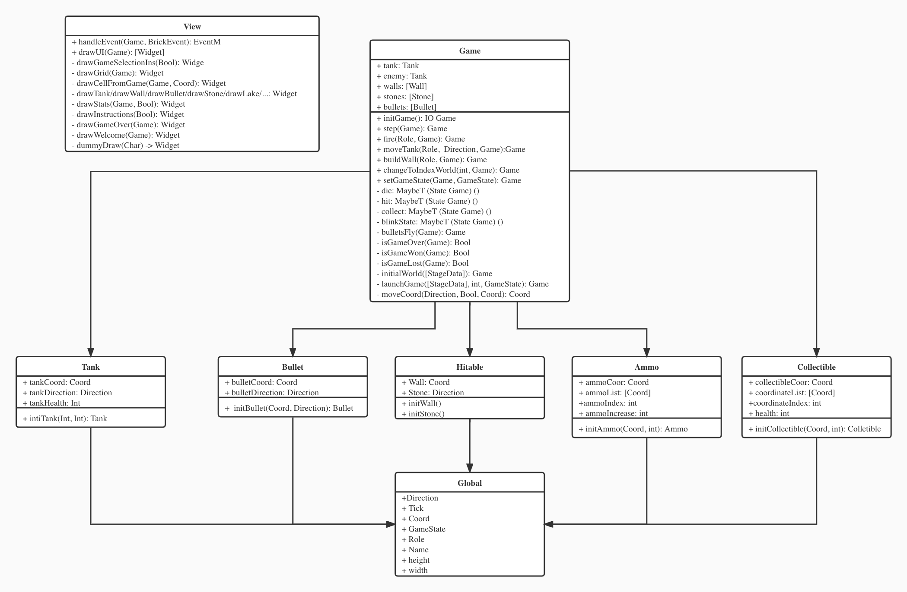

# haskell-tank-battalion
Final Project for UCSD CSE 230 Fall 2022

## Group Member
Fengyuan Wu A15535437  
Xinyuan Liang A59017604  
Na Sang A59001972  
Jiping Lin A15058075   

## Game
Tank Battalion is a classic shooter arcade video game in which the 2 players control tanks that defend their own base as well as destroy the other player's tank. The player will lose if either player's tank or base is destroyed by the other player. 


### Characters
The main characters of this game are tanks, where the player has one controllable tank that can move (up, down, left, and right) and fire.

### Board
The board consists of the following elements: Walls, Stones, Base, Ammo, Colletible, Bullet, Lake and Tanks.

1. Walls are destroyable objects: tanks cannot move through a wall and walls can be destroyed by bullets fired by tanks.
2. Stones are impenetrable objects: tanks cannot move through a brick; and brick cannot destroyed by bullets.
3. Lake is impentrable objects: tanks cannot move through a lake; but the bullet can fly above the lake and hit other objects.
4. Tanks are player objects that represent the character, when it is hit by a bullet, it is destroyed; if the player’s tank is destroyed, the player loses.
5. Ammo can strengthen the bullet by increasing its damage
6. Collitible can strengthen the player by adding his health.
7. Bullet can hit the walls, stones, tanks and bases; it can also fly across the lake.
8. Base is the player’s objective that needs to be defended: when it is hit by bullets for a certain number of times, it is destroyed and the player loses the game; the players can build wall by themselves to defence their base.


### Win/Lose Condition
The player will win if the other player's tank or base is destroyed.

## Architecture
This project aims to build a Haskell version of the Tank Battalion. The terminal user interface would be implemented using the brick library.


## Build & Run
```sh
stack build
stack run
```